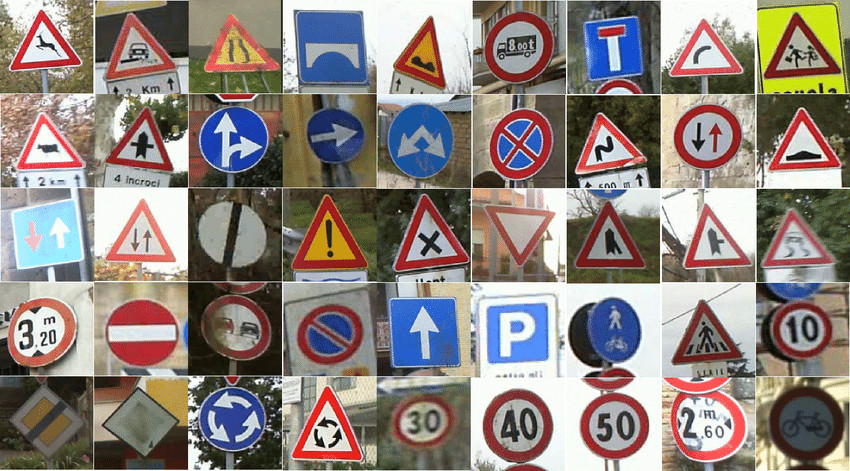

## Project: Traffic sign recognition program

Overview
---
In this project, I used what I've learned about deep neural networks and convolutional neural networks to classify traffic signs. I trained and validated a model so it can classify traffic sign images using the [German Traffic Sign Dataset](http://benchmark.ini.rub.de/?section=gtsrb&subsection=dataset). After the model is trained, I validated my work by trying out my model on images of German traffic signs that you find on the web. Ipython notebook was used to write the code.

A [detailed writeup](https://github.com/aliasaswad/CarND-Traffic-Sign-Classifier-P3/blob/master/writeup_template.md) of the project avaiable, that explain step by step what I had done.

The Project
---
The goals / steps of this project are the following:
* Load the data set
* Explore, summarize and visualize the data set
* Design, train and test a model architecture
* Use the model to make predictions on new images
* Analyze the softmax probabilities of the new images
* Summarize the results with a written report

Prerequisites
---
### TensorFlow

Throughout this project, I applied knowledge of neural networks on real datasets using [TensorFlow](https://www.tensorflow.org/), an open source Deep Learning library created by Google.

I used TensorFlow to classify images from the [German Traffic Sign Dataset](http://benchmark.ini.rub.de/?section=gtsrb&subsection=dataset) - a dataset of is a multi-class, single-image classification of traffic signs.

**Prerequisites**
Intro to TensorFlow requires [Python 3.4](https://www.python.org/downloads/) or higher and [Anaconda](https://www.anaconda.com/products/individual). If you don't meet all of these requirements, please install the appropriate package(s).
