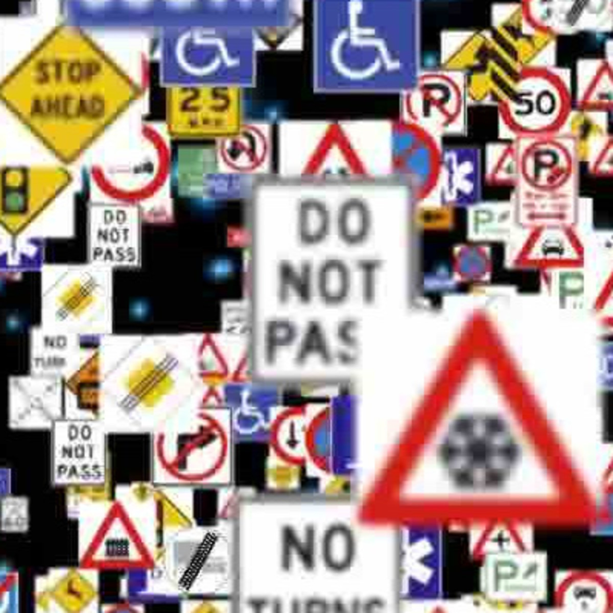

# **Traffic Sign Recognition** 

## Writeup

<!--  -->
|
|:--:| 
|*German Signs Image*|


## Build a Traffic Sign Recognition Project

### Deep Learning

The goals / steps of this project are the following:
* Load the data set (see below for links to the project data set)
* Explore, summarize and visualize the data set
* Design, train and test a model architecture
* Use the model to make predictions on new images
* Analyze the softmax probabilities of the new images
* Summarize the results with a written report


<!-- [//]: # (Image References)

[image1]: ./results_images/ "Visualization"
[image2]: ./examples/grayscale.jpg "Grayscaling"
[image3]: ./examples/random_noise.jpg "Random Noise"
[image4]: ./examples/placeholder.png "Traffic Sign 1"
[image5]: ./examples/placeholder.png "Traffic Sign 2"
[image6]: ./examples/placeholder.png "Traffic Sign 3"
[image7]: ./examples/placeholder.png "Traffic Sign 4"
[image8]: ./examples/placeholder.png "Traffic Sign 5" -->

[//]: # (Image References)

[img1]:  ./results_images/1_explored_images.png       "Explored_images"
[img2]:  ./results_images/2_labels_histo.png          "Labels Dist."
[img3]:  ./results_images/3_data_augmentation.png     "Image Processing"
[img4]:  ./results_images/4_train_augmented_histo.png "Train Processed Imgs"
[img5]:  ./results_images/5_preprocess.png            "Preprocess"
[img6]:  ./results_images/6_train_accu_loss.png       "Train, Accu., loss"
[img7]:  ./results_images/7_web_images.png            "Web Images"
[img8]:  ./results_images/8_preprocess_web_images.png "Preprocess W_images"
[img9]:  ./results_images/9_web_images_class.png      "W_images classi."
[img10]: ./results_images/10_web_images_predict.png   "W_images predict"

## Project

You could reach the project implementation [Traffic_Sign_Classifier.ipynb](https://github.com/aliasaswad/CarND-Traffic-Sign-Classifier-P3/blob/master/Traffic_Sign_Classifier.ipynb). Below, I will go through the details of the code implementation and I will discuss the results I've got.

### Step 0: Load The Data

In this steps, I used pickle library to load the data. The data consist of images and labels ad a numbers for these images. The labels are used to recognize what the images represent. [signnames.cvs](https://github.com/aliasaswad/CarND-Traffic-Sign-Classifier-P3/blob/master/signnames.csv) is a file that used to map lables to names, for example:

```python
label         name

 0:    'Speed limit (20km/h)',
 1:    'Speed limit (30km/h)',
 2:    'Speed limit (50km/h)',
 3:    'Speed limit (60km/h)',
 4:    'Speed limit (70km/h)',
 5:    'Speed limit (80km/h)',
 6:    'End of speed limit (80km/h)',
 7:    'Speed limit (100km/h)',
 8:    'Speed limit (120km/h)',
 9:    'No passing',
```

### Step 1: Data Set Summary & Exploration

I used the [pandas library](https://pandas.pydata.org/pandas-docs/stable/reference/api/pandas.DataFrame.shape.html) to calculate summary statistics of the traffic signs data set:

* Number of training examples = 34799
* Number of validation examples = 4410
* Number of testing examples = 12630
* Image data shape = (32, 32, 3)
* The number of unique classes/labels in the data set = 43

Here is an exploratory visualization of the dataset that randomly selected from 43 different images.

![alt text][img1]

Also, the below figures show how the labels are distribute

![alt text][img2]

#### Data Augmentation

In order to have more images to train out the model, I used applied image on the images and concatenate those images to the original images. The process called [data augmentation](https://www.techopedia.com/definition/28033/data-augmentation). The new images created from the original data by using image transformation (image processing). Four types of transformation were used, translation, resizing, and rotation.

```python
def image_process(image, process = 0):
    """
    Applying image processing like scale, transform, and translation.
    We need it when the training data is complex and have a few samples.
    """
    # Scale
    if process == 1:
        fx = 1.5; fy = 1.5
        return cv2.resize(image,None,fx=fx, fy=fy, interpolation = cv2.INTER_CUBIC)[0:32, 0:32,:]
    # Translation
    if process == 0: 
        X = 5; Y = 5
        P = np.float32([[1,0,Y],[0,1,X]])
    else:
        angle = 45
        P = cv2.getRotationMatrix2D((16,16),angle,1)
    
    return cv2.warpAffine(image,P,(32,32))
```

A sample from the output images as below

![alt text][img3]

The new transformed images concatenated with the original images and both used to train the model which provided even more distribution as shown below

![alt text][img4]


    
### Step 2: Design and Test a Model Architecture

[Deep learning neural network models learn a mapping from input variables to an output variable](https://machinelearningmastery.com/how-to-improve-neural-network-stability-and-modeling-performance-with-data-scaling/). Data preparation involves using techniques such as the normalization and standardization to rescale input and output variables prior to training a neural network model. Different ways of preprocessing are available to improve the image qualities like use gray scale and normalization. Min-max normalizationis one of the most common ways to normalize data. For every feature, the minimum value of that feature gets transformed into a 0, the maximum value gets transformed into a 1, and every other value gets transformed into a decimal between 0 and 1.


As a first step, I decided to convert the images to grayscale

```python
  # RGB to gray scale
  gray = cv2.cvtColor(img, cv2.COLOR_RGB2GRAY)
```
As a last step, I normalized the image data

```python
  # Normalized Data 'x'
  normalized (x) = (x-min(x))/(max(x)-min(x))
```
I decided to generate additional data and concatenate them to the original data set.
Here is an example of a traffic sign image after grayscaling and normalization.

![alt text][img5]


#### Model architecture 

I used [LeNet](http://yann.lecun.com/exdb/lenet/), convolutional neural networks (Yann LeCun, 1998) for my model architecture. I implemented the LeNet architecture using TensorFlow. This model was designed for hand written and machine printed character recognition. So, the model could be a good fit for the traffic sign classification. To improve the accuracy for the model to work with traffic signs, I maked the first two convolution layer deeper, also increase the size of the fully-connected layers. In addition two dropout layers were added. The new architecture that I applied makes accuracy above %95. The final model consisted of the following layers:

| Layer         		|     Description	        				| 
|:---------------------:|:-----------------------------------------:| 
| Input         		| 32x32x3 RGB image   						| 
| Convolution 1     	| 1x1 stride, same padding, outputs 28x28x16|
| RELU					|											|
| Max pooling	      	| 2x2 stride,  outputs 14x14x64 			|
| Convolution 2 	    | 1x1 stride, same padding, outputs 10x10x64|
| RELU					|											|
| Max pooling	      	| 2x2 stride,  outputs 5x5x64   			|
| Fatten					|										|
| Fully-connected 1		| 1600 										|
| RELU					|											|
| Dropout					|										|
| Fully-connected 2		| 240										|
| RELU					|											|
| Dropout				|											|
| Fully connected 3		| 43										|


#### Train, Validate and Test the Model

To train the model, I setup TensorFlow with `EPOCH = 40` and `BATCH_SIZE = 128` values. The `EPOCH` and `BATCH_SIZE` values affect the training speed and model accuracy. The LeNet architecture accepts a 32x32xC image as input, where C is the number of color channels. Train the LeNet archi. model to classify traffic signs data set. `x` is a placeholder for a batch of input images. `y` is a placeholder for a batch of output labels.

```python
x = tf.placeholder(tf.float32, (None, 32, 32, 1))
y = tf.placeholder(tf.int32, (None))
one_hot_y = tf.one_hot(y, 10)
```
Created a training pipeline that uses the model to classify the data set with learning rate equal to 0.001.
Here is my accuracy to epochs relation and loss calculation:

![alt text][img6]


My final model results were:
* training set accuracy of 100%
* validation set accuracy of 97.1%
* test set accuracy of 94.9%

 

### Step 3: Test a Model on New Images

I downloaded five German traffic signs images found on the web and I used the model to predict the traffic sign type.
Here are five German traffic signs that I found on the web:

![alt text][img7]

And, here is the images after applying the preprocess;

![alt text][img8]

An image histogram is a gray-scale value distribution showing the frequency of occurrence of each gray-level value. The output distribution value for the five images shown below:

![alt text][img9]

The model was able to correctly guess 4 of the 5 traffic signs, which gives an accuracy of ***80%***. The output images from the neural network as shown below:

![alt text][img10]

The only image that the model was unable to predict was the road work sign.

Here are the results of the prediction:

| Image			|     Prediction		| 
|:-------------:|:---------------------:| 
| 60 km/h		| Speed Limit (60km/h)	| 
| Stop Sign 	| Stop 					|
| Yield Sign	| Yield					|
| Left Turn		| Turn Left				|
| Road Work		| General Caution		|


For each of the new images, I printed out the model's softmax probabilities to show the certainty of the model's predictions (the top 5 probabilities for each image). `tf.nn.top_k` used to find the top k predictions for each image. `tf.nn.top_k` will return the values and indices (class ids) of the top `k` predictions. So if ***k=5***, for each sign, it'll return the **5** largest probabilities (out of a possible 43) and the correspoding class ids.

#### Softmax results

Looking at the softmax probabilities for each prediction. Below are the top 5 softmax probabilities for each image along with the sign type of each probability. 
For the **first image** (Speed 60km/h), the model is relatively sure that this is a stop sign (probability of 0.999898), and the image does contain a Speed limit (60km/h). The top five soft max probabilities were

| Probability         		|     Prediction	        							| 
|:-------------------------:|:-----------------------------------------------------:| 
| 0.999898         			| Speed limit (60km/h)  								| 
| 0.000067     				| Speed limit (50km/h) 									|
| 0.000033					| No passing											|
| 0.000002	      			| No passing for vehicles over 3.5 metric tons			|
| 0.000000				    | No passing for vehicles over 3.5 metric tons  		|


And here are the softmax probabilities for the five images:

```python
Image: web_images/60_kmh.jpg
Prob.:
   0.999898 : 3 - Speed limit (60km/h)
   0.000067 : 2 - Speed limit (50km/h)
   0.000033 : 9 - No passing
   0.000002 : 10 - No passing for vehicles over 3.5 metric tons
   0.000000 : 5 - Speed limit (80km/h)

Image: web_images/stop_sign.jpg
Prob.:
   0.420991 : 14 - Stop
   0.207210 : 36 - Go straight or right
   0.157999 : 1 - Speed limit (30km/h)
   0.083189 : 42 - End of no passing by vehicles over 3.5 metric tons
   0.060813 : 38 - Keep right

Image: web_images/yield_sign.jpg
Prob.:
   1.000000 : 13 - Yield
   0.000000 : 8 - Speed limit (120km/h)
   0.000000 : 2 - Speed limit (50km/h)
   0.000000 : 26 - Traffic signals
   0.000000 : 12 - Priority road

Image: web_images/left_turn.jpg
Prob.:
   1.000000 : 34 - Turn left ahead
   0.000000 : 28 - Children crossing
   0.000000 : 14 - Stop
   0.000000 : 36 - Go straight or right
   0.000000 : 37 - Go straight or left

Image: web_images/road_work.jpg
Prob.:
   1.000000 : 18 - General caution
   0.000000 : 19 - Dangerous curve to the left
   0.000000 : 27 - Pedestrians
   0.000000 : 28 - Children crossing
   0.000000 : 26 - Traffic signals

```

